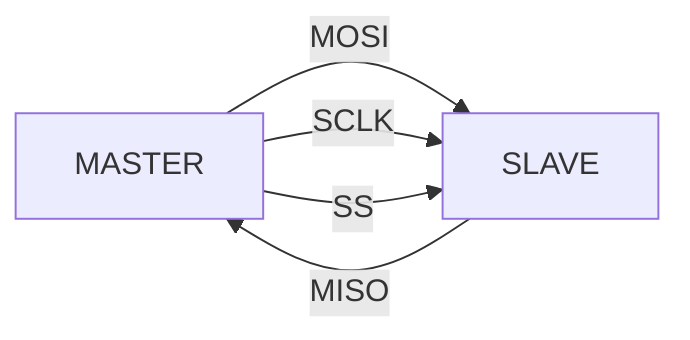
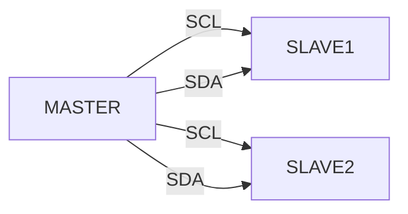
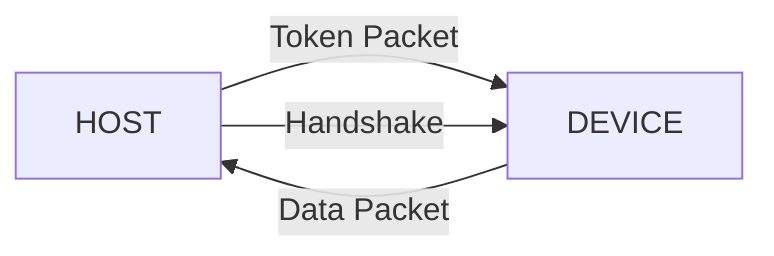
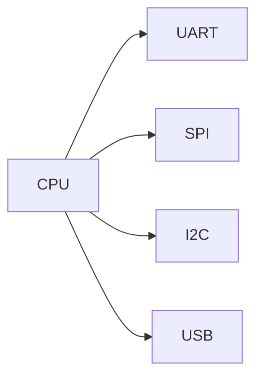
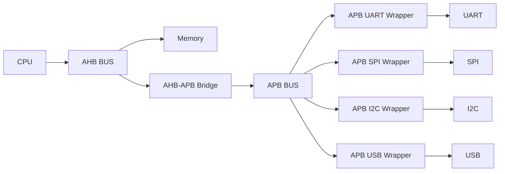
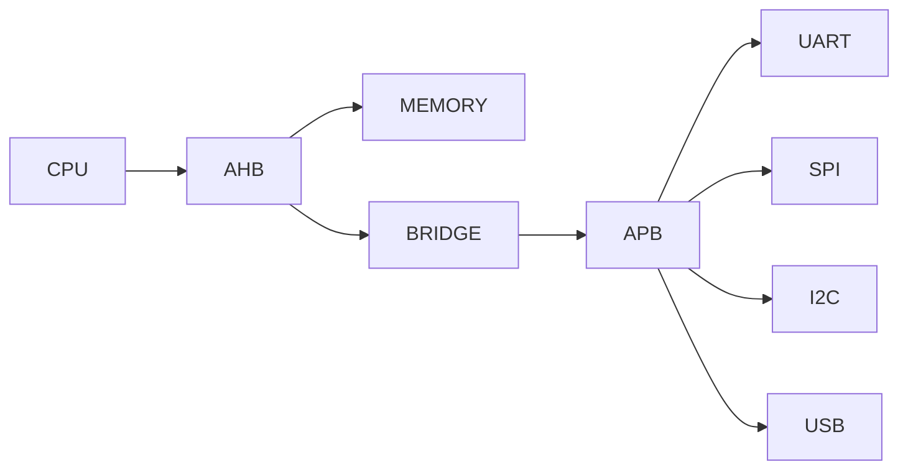

<h1 align="center"> SoC Communication Architecture: Peripheral → On-Chip Integration </h1>

<p align="center">


</p>

<p align="center">


</p>

---

<p align="center">
This project shows the transition from <b>Peripheral Communication Protocols</b> to <b>On-Chip Bus Architecture</b> leading to a complete <b>SoC design</b>.
</p>

---

# Peripheral Protocols (Completed)

## UART (Asynchronous Serial Communication)


- Asynchronous communication  
- TX ↔ RX data transfer  
- No shared clock  

---

## SPI (Serial Peripheral Interface)



- Master-slave communication  
- Full duplex  
- High-speed synchronous protocol  

---

## I2C (Inter-Integrated Circuit)



- Two-wire interface (SDA, SCL)  
- Multi-master support  
- Address-based communication  

---

## USB (Universal Serial Bus)



- Packet-based communication  
- Host-device architecture  
- Differential signaling  
- High-speed data transfer  

---

# Limitation of Direct Peripheral Connection



- Peripheral protocols (UART, SPI, I2C, USB) typically operate at **lower or moderate speeds compared to on-chip buses**  
- Direct CPU-to-peripheral connections increase routing complexity  
- Poor scalability as peripherals increase  
- Inefficient system design  

---

# On-Chip Protocols (Planned Development)

## AHB (Advanced High-performance Bus)

- We will be building a high-speed, low-latency on-chip interconnect  
- Will support burst transfers for efficient data movement  
- Will implement pipelined architecture for higher throughput  
- Target use: CPU, memory, and high-performance modules  


## APB (Advanced Peripheral Bus)

- We will be building a lightweight, non-pipelined bus  
- Optimized for low power and simple control logic  
- Designed for low-frequency peripheral communication  
- Target use: UART, SPI, I2C, USB, and similar peripherals  


## AHB-APB Bridge

- We will be designing a bridge between AHB and APB domains  
- Will handle protocol conversion and signal adaptation  
- Enables seamless communication between high-speed core and peripherals  


---

# SoC Architecture


---

# Data Flow Example


---

# Implementation Status

## Completed (Peripheral IPs)

- UART RTL implementation  
- SPI RTL implementation  
- I2C RTL implementation  
- USB RTL implementation  

Independent, reusable peripheral IP blocks developed and verified  

---

## Planned Development

### Phase 1: On-Chip Bus Design
- APB Bus (low-speed peripheral interconnect)  
- AHB Bus (high-performance system bus)  
- AHB Master (CPU-side transaction generator)  

### Phase 2: Peripheral Integration (APB Wrappers)
- APB UART  
- APB SPI  
- APB I2C  
- APB USB  
- APB RAM  

### Phase 3: Interconnect
- AHB to APB Bridge (protocol conversion + domain interfacing)  

### Phase 4: System Integration
- SoC Top-level design  
- Address decoding logic  
- Memory mapping and peripheral addressing  

### Phase 5: Advanced Integration
- RISC-V Core integration  

---

## Final Architecture Goal



A complete SoC integrating high-speed and low-speed domains using AMBA architecture  

---

# Planned Structure

```
ahb_bus/
apb_bus/
ahb_master/
ahb_apb_bridge/
apb_uart/
apb_spi/
apb_i2c/
apb_usb/
apb_ram/
soc_top/
riscv_core/
```

---

<p align="center"><b>
This repository shows the transition from standalone peripheral RTL to AMBA-based SoC architecture, progressing toward full system integration.
</p>

---
